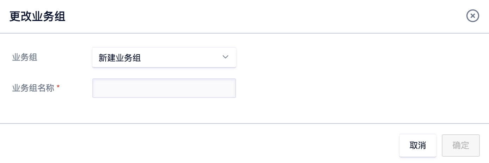

# 产品简介

## ULB简介

负载均衡（ULB）能够为多个主机或其它服务实例提供基于网络报文或代理方式的流量分发的功能。用于在高并发服务环境下，构建由多个服务节点组成的“负载均衡服务集群”。“服务集群”能够扩展服务的处理及容错能力，并可自动消除由于单一服务节点故障对服务整体的影响，提高服务的可用性。

目前ULB针对七层支持HTTP、HTTPs协议（类Nginx或HAproxy）；针对四层支持TCP协议及UDP协议（类LVS）。并且TCP协议支持两种方式：报文转发与请求代理。报文转发与请求代理模式详情可参考[TCP的请求代理与报文转发](https://docs.ucloud.cn/network/ulb/intro#tcp%E7%9A%84%E8%AF%B7%E6%B1%82%E4%BB%A3%E7%90%86%E4%B8%8E%E6%8A%A5%E6%96%87%E8%BD%AC%E5%8F%91)。四层ULB支持外网与内网两种模式，而七层ULB目前仅支持外网。您可以参考[如何选择ULB](https://docs.ucloud.cn/network/ulb/common#%E5%A6%82%E4%BD%95%E9%80%89%E6%8B%A9ulb)选择哪一层ULB来部署业务

## ULB基本概念

### ULB服务的结构

ULB服务主要由以下三个部分构成：

* ULB服务实例（LoadBalancer）
* 虚拟服务器（VServer）
* 后端服务器（Backend）

结构图如下所示：

### ULB名词解释

| 名词 | 全拼 | 中文 | 说明 |
| :--- | :--- | :--- | :--- |
| ULB | UCLoud Load Balancer | UCloud 负载均衡器 | ULB服务实例，绑定外网IP，创建VServer，并将云主机内网IP+端口加入到后端，以实现流量均衡与服务容错的功能。 |
| VServer | Virtual Server | 监听器 | 每个VServer是一组负载均衡前端端口配置，包含协议，端口，负载算法，会话保持，客户端超时等。 |
| RealServer | Real Server | 真实服务节点 | 由云主机内网IP+云主机端口组成的后端服务实例。 |
| EIP | Elastic IP | 弹性IP | 外网弹性IP，绑定在ULB上以提供外网访问地址及带宽。 |
| PIP | Private IP | 内网IP | 内网负载均衡提供服务的访问地址。 |

## ULB功能概览

| 功能 | 描述 |
| :--- | :--- |
| 协议支持 | TCP/UDP/HTTP/HTTPS |
| 健康检查 | 根据规则对后端业务服务器进行健康检查，自动隔离异常主机，一旦发现问题，迅速将问题主机切换，确保服务可用性。 |
| 会话保持 | 支持会话保持，用户可将其请求转发到同一台后端节点上。 |
| 调度算法 | 支持加权轮询、源地址，一致性哈希 |
| 域名转发 | 对HTTP或HTTPS协议（七层），ULB可按用户访问域名和URL转发流量到不同的后端节点。 |
| 监控 | 提供VServer链接数的监控数据 |
| 证书管理 | 针对HTTPS支持证书管理 |
| 可用区容灾 | 可自动实现负载均衡的跨可用区容灾 |

## ULB配置说明

ULB服务为region级服务，用户在某个region中创建的ULB服务实例，会分布在不同的可用区中，保证用户服务的可靠性。用户创建ULB服务实例，配置VServer（监听器）后，可以配置本region内本项目内的所有云主机作为后端服务器。以下是一些常见的配置说明，具体的实例及协议端口说明请参考操作指南。

### 会话保持

针对HTTP协议、HTTPS协议（七层服务）ULB基于Cookie支持会话保持功能。用户在配置时可以选择开启会话保持功能。会话保持支持两种方式：

**Cookie插入**：选择自动生成key，客户端的cookie插入操作都由ULB来分配和管理。

**用户指定Cookie插入**：用户可自定义key，ULB使用客户的key来分配和管理对客户端进行的Cookie插入操作

针对TCP协议的报文转发模式或UDP协议时（四层服务），是基于IP地址的会话保持。ULB会将来自同一IP地址的访问请求转发到同一台后端云服务器进行处理。

TCP协议的请求代理模式，不支持会话保持。

### 健康检查

ULB健康检查可判断后端服务器是否正常，对于异常的后端服务器，ULB将其从后端服务器池中移除，客户端请求将会在其他服务器之间进行分发。对于处于异常状态的服务器恢复正常时，会被ULB恢复至后端服务器池中。

**端口检查** ULB在每个可用区内部署专用服务器对会探测后端节点的IP+端口是否正常。探测频率为1s，连续三次探测失败后端服务器状态异常，连续三次探测正常，则后端服务器状态正常。注意：数据更新有6s延迟，故健康检查状态或有6s延迟。

所有协议均支持端口检查。但检测状态略有不同：HTTP、HTTPS以及TCP的请求代理模式的端口检查是用TCP进行探测。而TCP的报文转发模式及UDP协议则是使用选择的四层协议做端口探测。

**HTTP检查** 通过HTTP HEAD请求检查后端服务器上的应用是否可用。要求后端服务器支持HEAD请求。

用户使用HTTP健康检查，需要配置HTTP检查路径和HTTP检查域名，两者拼接组成了HTTP检查的URL，ULB会对此URL发起HTTP HEAD请求，请求响应码为2xx或3xx则认为后端服务器正常。健康检查探测周期为2s，连续3次探测失败后端节点变更为不健康，连续两次正常变更为健康

HTTP检查路径，最多为227个字符，直接填写域名或IP地址后的相对路径文件。可以选择首页、出现异常概率较小的页面、专门为健康检查准备的空文件（HTTP HEAD请求可以获得200的响应码即可），选择首页可能会加大服务器压力，不建议选择首页作为HTTP健康检查的域名和路径。

HTTP检查域名，不建议填写"http:_"或"https:_"，直接填写域名或IP地址即可。支持主域名、二级域名等多级域名。

HTTP检查支持的协议:HTTP协议、HTTPS协议（七层服务）。

### 错误码说明

ULB的错误码基本是遵循http的规范；请求有误，返回4XX，比如请求方式不对，返回400 Bad request，请求读超时，返回408； 服务端出了问题，返回5XX，比如后端server连接不上，返回 503，后端读失败502，后端读超时504，其它500 所有错误码详情见：

400 Bad request；Your browser sent an invalid request.

403 Forbidden；Request forbidden by administrative rules.

408 Request Time-out；Your browser didn't send a complete request in time.

500 Server Error An internal server error occured.

502 Bad Gateway The server returned an invalid or incomplete response.

503 Service Unavailable No server is available to handle this request.

504 Gateway Time-out The server didn't respond in time.

### TCP的请求代理与报文转发

**使用HTTP做请求代理和TCP请求代理模式的区别**

TCP请求代理模式运行在ISO/OSI网络结构的4层上面，而使用HTTP做请求代理时运行在7层上。

TCP的代理做的工作是：接收请求，选择后端节点，连接后端节点，转发内容；可以将上层其他协议的报文直接转发至后端RS。

HTTP代理的工作是：接收请求，解析请求，根据转发规则选择backend pool，根据ULB算法选择后端节点，连接后端节点，接收响应，解析响应头，添加适当的响应头（如Set-cookie等），返回响应内容给客户端。

可以看到，请求代理需要维护客户端到ULB和ULB到后端节点的两个TCP连接（需要经历两次TCP握手），而报文转发只需要对报文的解析和转发，少去了连接建立的开销，这样报文转发的效率高于请求代理模式多个数量级。

但使用报文转发方式同时具有一些其他限制：

1、TCP报文转发模式不能支持同一个后端RS监听不同的端口，请求代理模式下并无此限制。

2、TCP报文转发模式的后端必须配置ULB的VIP，而TCP的请求代理模式则无需此配置。

故建议用户如无在一个RS上监听多个端口的需求，则可选择报文转发模式。

### 连接空闲超时

对客户端向ULB发送的请求，ULB将维护两个连接。一个连接指向客户端，另一个连接指向后端RS。超过连接空闲超时期限后，如果没有发送或接收任何数据，ULB将关闭连接。 ULB中默认打开连接保持，默认连接保持时间为60秒。例如在第一次发包后连接将会保持60秒，如果距上一次发包60秒内没有新的TCP包，连接将会断开。 用户可以根据自己的业务需要设置连接空闲超时的阈值。目前具有连接空闲超时的协议有HTTP、HTTPS、TCP的请求代理模式。

### 负载均衡算法

ULB分为请求代理和报文转发两种模式。

* 目前请求代理模式支持轮询、源地址、加权轮询、最小连接数四种算法。

1. 轮询算法下, ULB接收到新的TCP连接后, 依次转给每个后端主机。
2. 源地址算法下, ULB会根据TCP连接的源地址，利用一定的哈希算法将请求其转给某台主机。之后用户再以相同IP访问, 如主机数量不变时，访问还是会落到该台主机。
3. 加权轮询算法下，ULB接收到新的TCP连接后，将根据您指定的后端主机的不同权重，按照概率分配给各个后端主机。
4. 最小连接数算法下，ULB接受到新的TCP连接后，会实时统计ULB到后端主机的连接数，选择连接数最低的主机建立新连接并发送数据。

* 目前报文转发模式支持轮询、源地址、一致性哈希、源地址（计算端口）、一致性哈希（计算端口）、加权轮询六种算法。

1. 轮询算法。同上。
2. 源地址算法。同上。
3. 一致性哈希算法。一致性哈希算法是根据源目的IP，使用一致性哈希算法的结果选择后端主机。如果增加或者删减后端主机，仅仅会影响小部分连接。
4. 源地址（计算端口）算法。ULB会根据TCP连接的源地址和源端口，利用一定的哈希算法将请求其转给某台主机。
5. 一致性哈希（计算端口）算法。根据源目的IP、源目的端口，使用一致性哈希算法的结果选择后端主机。如果增加或者删减后端主机，仅仅会影响小部分连接。
6. 加权轮询算法。同上。

