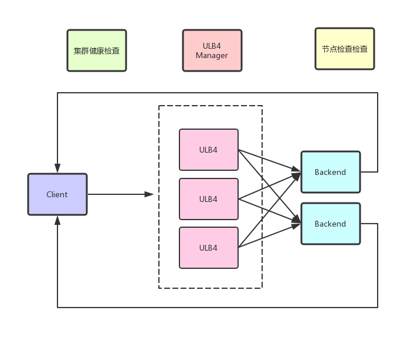

# 技术架构

ULB（UCloud Load Balancer）提供流量分发的能力，保证业务可扩展和高可用。支持内网和外网两种场景，支持请求代理和报文转发两种转发模式。下文将分别介绍ULB的的请求代理（下简称ULB7）和报文转发模式（下简称ULB4）的基本架构。

### 内网ULB4

内网ULB4是基于DPDK自研的。单台服务器可以提供超过3000万并发连接，1000万 pps，10G线速转发能力。采用集群部署，单个集群至少4台服务器。利用ECMP+ BGP实现高可用。

报文转发模式采用了类似于DR的转发模式。内网负载均衡转发示意图如下：

如上图，同一个集群的ULB4通过向其上联的接入交换机宣告相同的VIP，从而组成集群。

### 架构概览

四层ULB基于DPDK开发，单台服务器可以提供超过3000万并发连接，1000万 pps，10G线速转发能力。采用集群部署，单个集群至少4台服务器。同样利用ECMP+ BGP实现高可用。

七层ULB基于Haproxy开发，单个实例可以支持超过40w pps，2Gbps，以及200万并发连接。ULB利用CPU的亲和性，实现核的隔离和资源控制。

